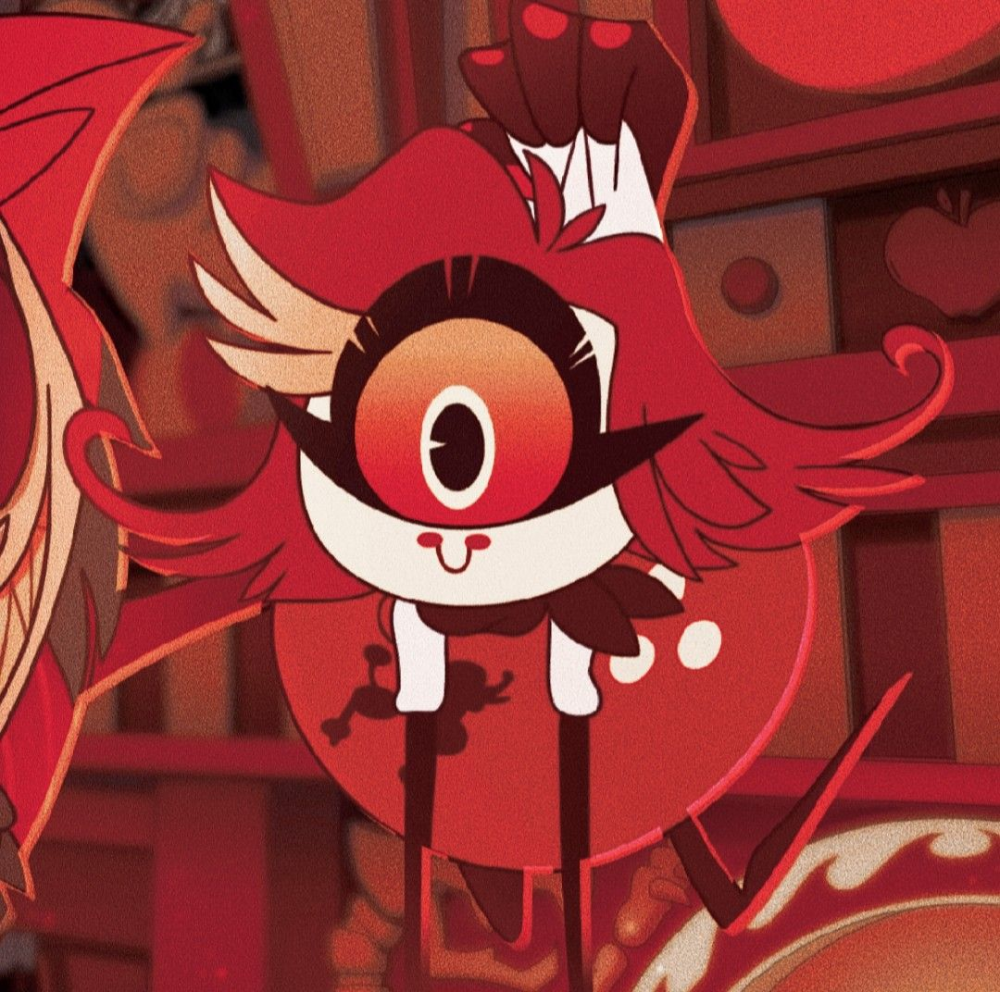
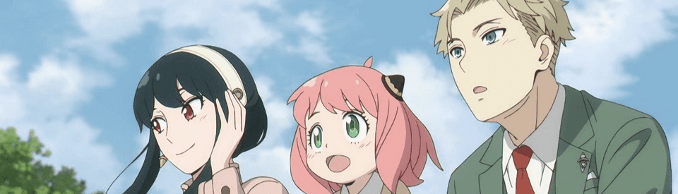

<body>
    <section>
        <h1 align="center"> ~ ❤️ Welcome to my profile! ❤️ ~ </h1>
        

            
        

        
 My name is Evie, a passionate developer and gameplayer. 

        
 She/her/hers 

    </section>
    <section>
        <h1 align="center" style="font-size:1.5em;"> ☕ About me! </h1>
        
 I'm a 17 year old student from Ireland, my hobbies are coding, gaming, anime & manga. 

    </section>
    <section>
        <h1 align="center" style="font-size:1.5em;"> 💻 My Experience! </h1>
        
        
 
            I'm currently studying Computer Science as a subject for the Irish leaving certificate, i have also worked on many projects such as Kythi.com & Jet.pics.  
        

    </section>
     
    <section>
        <h1 align="center" style="font-size:1.5em;"> 📝 Contact me! </h1>
        
 
            For the fastest response, you can contact me on Discord! - <a href="https://discord.com/users/1176802609416392745">catforgor</a>
        

          
 
            You can also contact me on email! - 
            <a href="mailto:eeviefogarty@gmail.com">
                eeviefogarty@gmail.com
            </a>
        

    </section>
    <section>
        <h1 align="center" style="font-size:1.5em;"> ~ ❤️ THANKS FOR READING ❤️ ~ </h1>
        
    </section>
</body>

<!--
Here are some ideas to get you started:

- 🔭 I’m currently working on ...
- 🌱 I’m currently learning ...
- 👯 I’m looking to collaborate on ...
- 🤔 I’m looking for help with ...
- 💬 Ask me about ...
- 📫 How to reach me: ...
- 😄 Pronouns: ...
- ⚡ Fun fact: ...
-->
